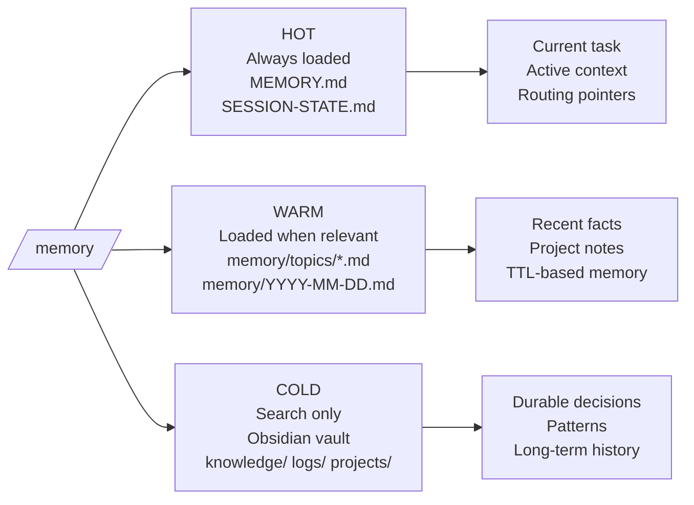
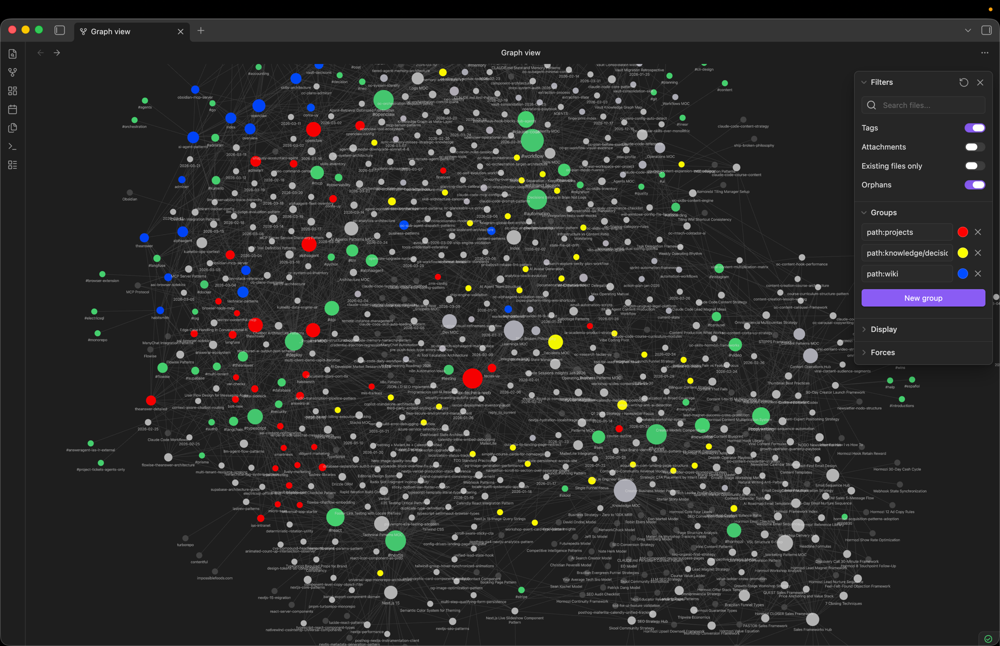

# /memory, persistent memory for AI agents

[](LICENSE)
[](CHANGELOG.md)

**AI agents forget everything. `/memory` gives them a second brain.**

It adds persistent memory to Claude Code, OpenClaw, and Gemini CLI with a simple 3-tier model:

- **HOT** for always-loaded context
- **WARM** for recent project knowledge
- **COLD** for long-term knowledge in your Obsidian vault

Session hooks capture what matters automatically, `/memory sync` consolidates it, and your agent starts the next session with the right context instead of a blank slate.

## Why this exists

Every new session usually starts with the same expensive loop:

1. You re-explain the project
2. The agent re-discovers past decisions
3. You burn time and tokens rebuilding context

That is the **agent amnesia tax**.

`/memory` fixes it by saving the right things at the right depth, then loading only what is needed next time.

- **Less re-briefing**
- **Better continuity across sessions**
- **Lower token usage**
- **A searchable second brain in Obsidian**

Claude Code:
```bash
/plugin marketplace add maxtechera/memory
```

OpenClaw:
```bash
clawhub install memory
```

Then run:
```bash
/memory setup
```

---

## The 30-second architecture



### How to think about it

| Tier | What lives there | When it loads | Why it matters |
|---|---|---|---|
| **HOT** | `MEMORY.md`, `SESSION-STATE.md` | Every session | Gives the agent immediate orientation |
| **WARM** | topic files, daily journals | When relevant | Keeps useful context nearby without bloating prompts |
| **COLD** | Obsidian vault | Search only | Stores durable knowledge without forcing full-load context |

**Mental model:** keep the prompt tiny, keep recent context reachable, keep long-term knowledge searchable.

---

## The standout feature, 7 lifecycle hooks

These hooks are what make `/memory` feel automatic instead of manual.

| Hook | Lifecycle moment | What it does | Why you care |
|---|---|---|---|
| `session-start-vault.sh` | Session starts | Injects vault awareness, recent journal counts, and memory context | The agent begins oriented instead of blank |
| `pre-compact-vault.sh` | Before context compaction | Saves live session state into the journal before anything is compressed away | Important context survives long sessions |
| `session-stop-vault.sh` | Session ends | Flushes state to the vault and local compaction state | The next session has continuity |
| `agent-start.sh` | Subagent starts | Passes run ID, parent task, MEMORY router, and warm-topic pointers | Helpers do not need a full re-brief |
| `agent-stop.sh` | Subagent ends | Tracks helper completion state | Multi-agent runs stay coordinated |
| `compact-notification.sh` | After compaction | Prints vault stats and session-state preview | You can see what persisted |
| `force-mcp-connectors.sh` | Session starts | Forces MCP connectors flag on supported setups | Integrations come up consistently |

**Why this matters:** most memory tools ask you to remember to save memory. `/memory` remembers for you.

---

## Quick start, clean Claude Code install

### 1. Install the skill

```bash
/plugin marketplace add maxtechera/memory
```

### 2. Run setup once

```bash
/memory setup
```

Setup will:
- detect your Obsidian vault
- install the lifecycle hooks
- validate the Obsidian CLI path
- prepare local memory files

### 3. Start working normally

You do not manually call hooks. They fire automatically on session lifecycle events.

### 4. Save what the agent learned

```bash
/memory sync
```

### 5. Check health anytime

```bash
/memory status
```

### First-session example

```bash
# install
/plugin marketplace add maxtechera/memory

# one-time setup
/memory setup

# work in Claude Code as usual

# persist the session's useful knowledge
/memory sync

# verify memory health
/memory status
```

If you also use OpenClaw:

```bash
clawhub install memory
```

---

## Obsidian integration

Your Obsidian vault is the long-term memory layer and the single source of truth.

### Required CLI commands

```bash
/memory setup
/memory sync
/memory dream
/memory status
```

### Optional environment variables

```bash
export OBSIDIAN_VAULT_PATH="$HOME/Documents/my-vault"
export OBSIDIAN_CLI_PATH="/usr/local/bin/obsidian"
export OPENCLAW_CONFIG_PATH="/path/to/openclaw-config"
```

### Vault folder map

```text
<your-obsidian-vault>/
├── knowledge/        # durable patterns, decisions, learnings
├── logs/             # journals and execution traces
├── projects/         # project-specific long-term context
├── identity/         # preferences, stable personal context
└── wiki/             # compiled LLM wiki pages for publishing/sync
```

### What goes where

| Location | Purpose |
|---|---|
| `knowledge/` | Reusable insights and durable decisions |
| `logs/` | Daily journals and sync traces |
| `projects/` | Project memory that lasts longer than a single session |
| `identity/` | Stable user preferences and operating context |
| `wiki/` | Compiled knowledge pages maintained by the LLM |

---

## Example workflows

### Example 1, continue a project without re-explaining it

```bash
# yesterday you worked on auth
/memory sync

# today you reopen Claude Code
# hooks load hot memory automatically
# the agent starts with the right project context
```

### Example 2, capture a long session before compaction loses detail

```bash
# large session, lots of design decisions
# pre-compact hook fires automatically
# key state gets appended before compression
```

### Example 3, keep Claude Code and OpenClaw aligned through Obsidian

```bash
# Claude Code
/memory sync

# OpenClaw later
clawhub install memory

# both environments read from the same vault-backed knowledge base
```

---

## Why a 3-tier architecture instead of a vector database

Most memory products jump straight to embeddings. `/memory` uses a simpler model that is easier to inspect, cheaper to run, and better aligned with how agents actually need context.

| | `/memory` | Mem0 / Letta / Zep | Vector DB solutions |
|---|---|---|---|
| Storage | Markdown + Obsidian | Cloud API / hosted | Vector embeddings |
| Cost | Free | Paid API | Infrastructure cost |
| Privacy | 100% local | Cloud | Often cloud |
| Cross-platform | Claude Code + OpenClaw + Gemini CLI | Framework-specific | Framework-specific |
| LLM wiki built-in | Yes | No | No |
| Setup | One command | SDK integration | Infra setup |

**No embeddings. No hosted dependency. No black box.**

Just markdown, hooks, and a vault you already control.

---

## Images




*Every node is a memory, automatically written and connected across sessions.*

---

## Commands

| Command | Description |
|---------|-------------|
| `/memory setup` | Configure vault path, detect platforms, install hooks |
| `/memory sync` | Save everything to memory across HOT, WARM, COLD, and wiki |
| `/memory status` | Inspect health, tier sizes, TTL alerts, last syncs |
| `/memory audit` | Run TTL and boundary checks |
| `/memory dream` | Consolidate insights, prune, audit TTL decay, rebuild wiki |
| `/memory wiki init` | Initialize wiki structure in the vault |
| `/memory wiki ingest [source]` | Convert raw sources into compiled wiki pages |
| `/memory wiki ingest --from-memory` | Build wiki pages from memory digests and topics |
| `/memory wiki query [topic]` | Query compiled wiki pages |
| `/memory wiki sync notion` | Publish ready wiki pages to Notion |
| `/memory wiki sync --full` | Rebuild and sync from scratch |
| `/memory wiki lint` | Validate wiki health and structure |
| `/memory wiki dream` | Consolidate and rebuild the wiki |
| `/memory wiki status` | Inspect wiki freshness and publish queue |

---

## Manual hook installation

If you do not want to rely on `/memory setup`, you can install the hooks yourself.

```bash
MEMORY_DIR="/path/to/memory"
for hook in session-start-vault.sh pre-compact-vault.sh session-stop-vault.sh \
            agent-start.sh agent-stop.sh compact-notification.sh force-mcp-connectors.sh; do
  ln -sf "$MEMORY_DIR/hooks/$hook" ~/.claude/hooks/
done
```

Then merge these events into the `hooks` key in `~/.claude/settings.json`:

```json
{
  "hooks": {
    "SessionStart": [{ "hooks": [
      {"type": "command", "command": "bash ~/.claude/hooks/session-start-vault.sh"},
      {"type": "command", "command": "bash ~/.claude/hooks/force-mcp-connectors.sh"}
    ]}],
    "PreCompact": [{ "hooks": [
      {"type": "command", "command": "bash ~/.claude/hooks/pre-compact-vault.sh"}
    ]}],
    "Stop": [{ "hooks": [
      {"type": "command", "command": "bash ~/.claude/hooks/session-stop-vault.sh", "async": true}
    ]}],
    "SubagentStart": [{ "hooks": [
      {"type": "command", "command": "bash ~/.claude/hooks/agent-start.sh", "async": true}
    ]}],
    "SubagentStop": [{ "hooks": [
      {"type": "command", "command": "bash ~/.claude/hooks/agent-stop.sh", "async": true}
    ]}],
    "Notification": [{ "matcher": "compact", "hooks": [
      {"type": "command", "command": "bash ~/.claude/hooks/compact-notification.sh"}
    ]}]
  }
}
```

---

## Memory boundary rules

**`MEMORY.md` contains facts. `AGENTS.md` contains rules. Never mix them.**

| File | Contains | Never contains |
|---|---|---|
| `MEMORY.md` | Facts, pointers, project index | Rules, instructions |
| `AGENTS.md` | Behavioral rules, policies | Project facts, configs |
| `SESSION-STATE.md` | Live context, working state | Durable long-term facts |
| `memory/topics/*.md` | Domain facts with TTL | Rules |
| Obsidian `knowledge/` | Patterns, decisions, learnings | Ephemeral session noise |

---

## TTL decay

Every memory entry has a shelf life.

| Class | Suffix | Default TTL | Example |
|---|---|---|---|
| permanent | none | forever | Core architecture decisions |
| operational | `[date:6m]` | 6 months | API versions, tool configs |
| project | `[date:3m]` | 3 months | Project-specific facts |
| session | `[date:1m]` | 30 days | Research notes, temporary findings |

Run `/memory dream` weekly to audit and prune expired entries.

---

## What this repo contains

```text
memory/
├── SKILL.md              # The skill agents read
├── WORKFLOW.md           # 5-stage sync lifecycle
├── README.md             # This file
├── hooks/                # 7 session lifecycle hooks
├── docs/
│   ├── VISION.md
│   ├── STATE_MACHINE.md
│   ├── ARCHITECTURE.md
│   └── SYNC_PROTOCOL.md
├── examples/
├── .claude-plugin/
├── .codex-plugin/
├── .agents/
├── gemini-extension.json
├── .env.example
├── .clawhubignore
└── .github/workflows/
```

---

## Principles

1. Vault is the single source of truth
2. WAL-first persistence beats memory loss
3. Facts and rules never mix
4. Context should decay unless explicitly durable
5. Deduplicate before writing
6. Show what was saved, skipped, or flagged

---

## License

MIT, see [LICENSE](LICENSE).

Maintained by [maxtechera](https://github.com/maxtechera).
